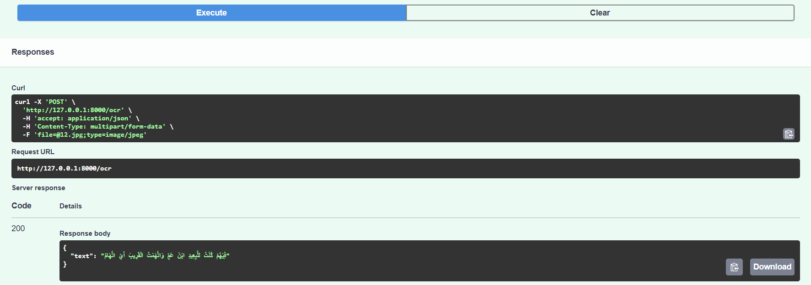

# Arabic OCR API using Vision Language Models

This project provides an Arabic Optical Character Recognition API built using a Vision Language Model fine tuned with LoRA adapters and deployed as a FastAPI service inside Docker.

The system extracts Arabic text from images and exposes the functionality through a simple REST API.

---

## Features

1. Arabic OCR using a fine tuned Qwen2.5 VL 3B model
2. LoRA based adaptation for improved Arabic text extraction
3. FastAPI based inference service
4. Dockerized deployment for reproducibility
5. Request level logging and timing
6. CPU based inference suitable for local testing and demos

---

## Example OCR Response

Below is an example request and response using the `/ocr` endpoint via the FastAPI Swagger UI.

